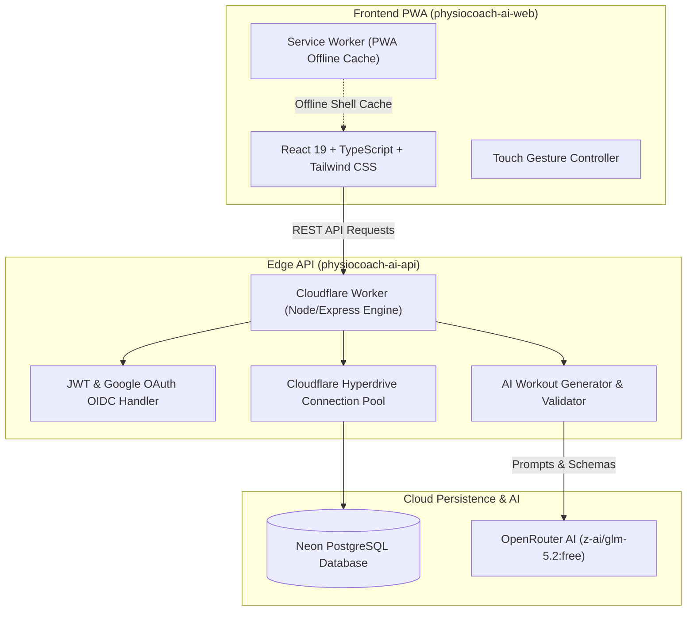

# PhysioCoach AI

<div align="center">
  <h3>Precision Posture-Aware Athletic Training & Rehabilitation Platform</h3>
  <p><strong>Full-Stack Progressive Web App (PWA) & Edge Serverless Architecture</strong></p>

  [](https://physiocoach.otconnect.ir)
  [](https://physiocoach-ai-api.otconnect.ir/api/v1/health)
  [](https://developers.cloudflare.com/pages/)
</div>

---

## 🌟 Overview

**PhysioCoach AI** is an intelligent, posture-aware training programming and live gym workout tracking platform. It creates personalized progressive overload splits calibrated around biomechanical limits, posture flags, and equipment availability while providing real-time workout tracking on the gym floor.

---

## 🚀 Key Features

### 1. 🦾 Biomechanical & Posture-Aware AI Engine
- **Clinical Contraindication Filter:** Analyzes musculoskeletal flags (lumbar load sensitivity, shoulder impingement, knee shearing) and automatically swaps hazardous exercises for joint-friendly biomechanical equivalents.
- **Progressive Overload Modeling:** Dynamic volume, RPE scaling, and rep-in-reserve calibration tailored to training experience and equipment.
- **Zero Hallucination Standard:** Strict JSON schema validation with OpenRouter LLMs (`z-ai/glm-5.2:free` primary) and deterministic safety validation.

### 2. 📱 Native Mobile PWA & Touch Gesture System
- **Direction-Locked Day Swiper:** Smooth horizontal swipe gesture to flick between workout days with zero vertical scroll conflicts.
- **Locked Mobile Viewport:** Strict `100dvh` root boundary preventing browser shell scroll in mobile Chrome and Safari.
- **Installable PWA (`sw.js`):** Production Service Worker with offline shell pre-caching, Stale-While-Revalidate asset caching, and standalone home screen launch.
- **Zero Content Flicker:** Athletic skeleton loaders eliminating layout jumps during API data hydration.

### 3. ⏱️ Live Workout HUD & Gym Utility
- **Automated Rest Countdown Clock:** Rest timers with audio finish chimes.
- **Barbell Plate Calculator:** Instant visual plate breakdowns (20kg, 15kg, 10kg, 5kg, 2.5kg, 1.25kg).
- **Smart Exercise Swapper:** Instant movement pattern replacements filtered by available gym equipment.

### 4. 🔒 Enterprise-Grade Authentication
- **Dual Authentication Support:** First-party email & password authentication (PBKDF2 / Argon2 hashing) with rotating JWT refresh tokens and live Google OAuth OIDC integration.
- **Strict Role-Based Access:** Scoped user sessions with cryptographically signed tokens.

---

## 🏗️ Architecture & Tech Stack



### Technology Breakdown

| Layer | Technology |
|---|---|
| **Frontend** | React 19, TypeScript, Vite, Tailwind CSS, Lucide Icons, PWA Service Worker |
| **Edge Compute** | Cloudflare Workers (`cloudflare:node` / Express Router adapter) |
| **Database & ORM**| Neon PostgreSQL, Cloudflare Hyperdrive, Drizzle ORM |
| **AI Synthesis** | OpenRouter (`z-ai/glm-5.2:free`, `gemini-3.7-flash`, `gemini-3.5-flash-lite`) |
| **Hosting & CDN** | Cloudflare Pages (`physiocoach.otconnect.ir`) |

---

## 📁 Monorepo Structure

```
apps/PhysioCoach Ai/
├── physiocoach-ai-web/     # React 19 PWA frontend application
│   ├── src/
│   │   ├── components/     # UI components, Modals, Skeletons, Visuals
│   │   ├── context/        # Auth, Theme, and Preferences state
│   │   ├── pages/          # Dashboard, Plan, Session, Settings, Assessment
│   │   └── services/       # API client, Audio cues, Safety notes
│   ├── public/             # PWA manifest, Service Worker (sw.js), App icons
│   └── vite.config.ts      # Vite bundler configuration
│
├── physiocoach-ai-api/     # Cloudflare Worker REST API backend
│   ├── src/
│   │   ├── auth/           # Password hashing, JWT signing, Token verification
│   │   ├── db/             # Drizzle schemas, migrations, and client
│   │   ├── routes/         # Auth, Profile, Assessment, Workout Plans, Sessions
│   │   ├── services/       # AI Workout synthesis, Safety validation
│   │   └── types/          # Zod contracts & TypeScript schemas
│   └── wrangler.jsonc      # Cloudflare Worker deployment configuration
└── README.md
```

---

## 🚀 Getting Started

### Prerequisites
- **Node.js:** `>= 20.x` (Recommended: v22.x or v24.x)
- **Package Manager:** `npm` or `pnpm`
- **Cloudflare CLI:** `wrangler`

---

### 1. Backend API Setup (`physiocoach-ai-api`)

```bash
cd physiocoach-ai-api
npm install

# Start local API dev server (proxies to Cloudflare Hyperdrive & Neon PostgreSQL)
npm run dev
```

### 2. Frontend Web Setup (`physiocoach-ai-web`)

```bash
cd physiocoach-ai-web
npm install

# Start local Vite development server
npm run dev
```

Visit `http://localhost:5173` in your browser.

---

## 🚢 Deployment

### Deploying the Backend API (Cloudflare Workers)
```bash
cd physiocoach-ai-api
npx wrangler deploy
```

### Deploying the Frontend (Cloudflare Pages)
```bash
cd physiocoach-ai-web
npm run build
npm run deploy
```

---

<div align="center">
  <sub>Developed with pride by <a href="https://github.com/rasoulveisi">Rasoul Veisi</a> · Production on Cloudflare Edge</sub>
</div>
