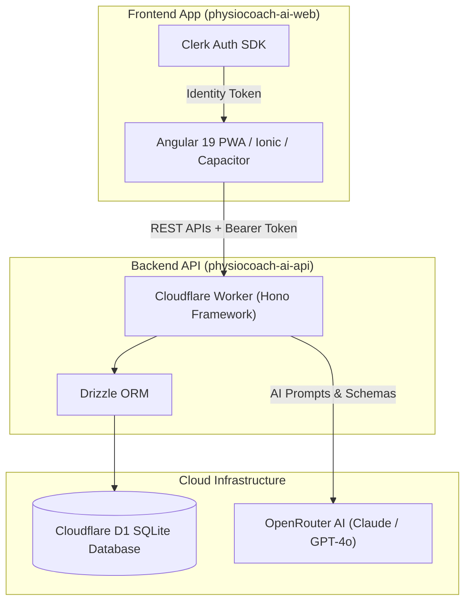

# PhysioCoach AI Monorepo

<div align="center">
  <h3>AI-Powered Physical Therapy & Rehabilitation Platform</h3>
  <p><strong>Cross-platform Angular PWA + Capacitor Mobile App & Cloudflare Worker API</strong></p>

  [](https://physiocoach.otconnect.ir)
  [](https://developers.cloudflare.com/workers/)
</div>

---

## 🌟 Overview

**PhysioCoach AI** is an intelligent physical therapy and rehabilitation coaching system designed to deliver personalized exercise programs, dynamic patient onboarding, AI-driven movement assessments, and automated recovery tracking.

### Key Features:
- 📱 **Cross-Platform Delivery:** Angular 19 PWA with Ionic & Capacitor for seamless web and native mobile deployment.
- ⚡ **Serverless AI Backend:** Cloudflare Worker running Hono, connected to Cloudflare D1 (SQLite) and OpenRouter LLMs.
- 🎯 **Deterministic Workout Plans:** Structured AI generation with strict JSON schema validation and safe fallback exercise matrices.
- 🔒 **Secure Authentication:** Clerk Authentication integration with JWT verification on API endpoints.

---

## 🏗️ Architecture Diagram



---

## 📁 Repository Structure

```
apps/PhysioCoach Ai/
├── physiocoach-ai-web/     # Angular 19 + Ionic + Capacitor frontend application
├── physiocoach-ai-api/     # Hono + Cloudflare Worker API with D1 database & Drizzle ORM
├── CODEX_INSTRUCTIONS.md   # Architectural guidelines & refactoring plans
└── README.md               # Monorepo documentation
```

---

## 🚀 Getting Started

### Prerequisites:
- **Node.js:** v24.14.0 or later
- **Package Manager:** `pnpm` v11.21.0
- **Cloudflare CLI:** `npx wrangler`

### 1. Setup API (`physiocoach-ai-api`)
```bash
cd apps/PhysioCoach\ Ai/physiocoach-ai-api
pnpm install
pnpm run dev
```

### 2. Setup Web Frontend (`physiocoach-ai-web`)
```bash
cd apps/PhysioCoach\ Ai/physiocoach-ai-web
pnpm install
npm run start
```

---

<div align="center">
  <sub>Developed by <a href="https://github.com/rasoulveisi">Rasoul Veisi</a> · Deployed on Cloudflare Pages & Workers</sub>
</div>
