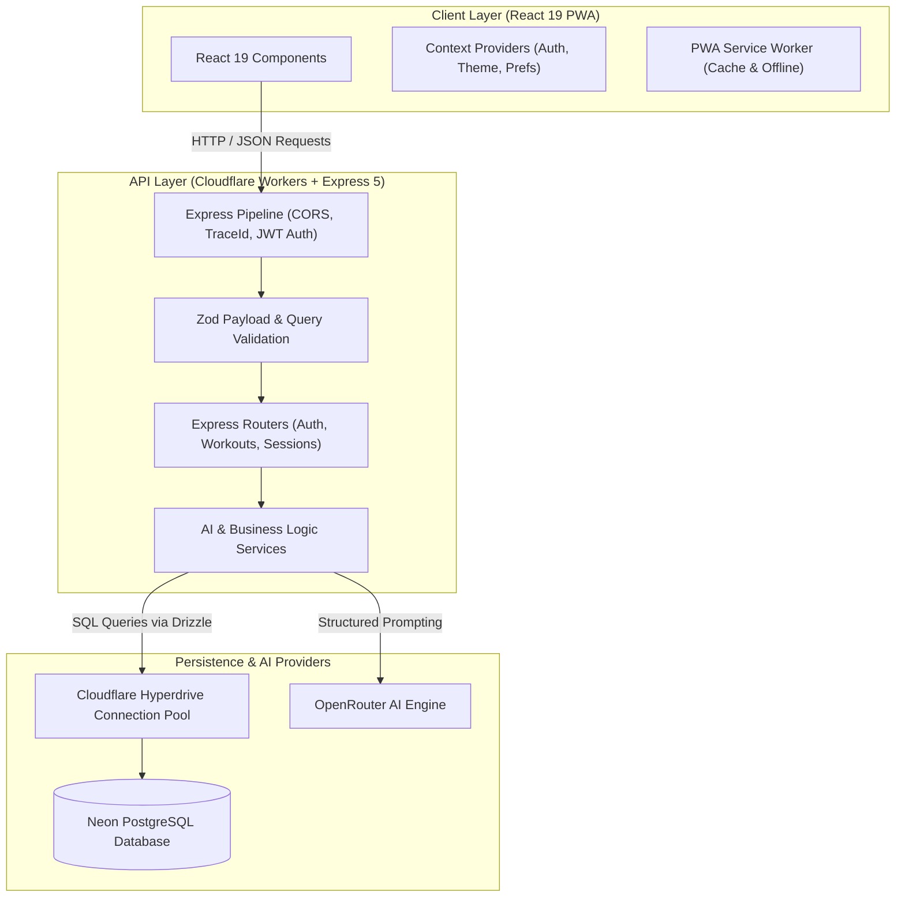

# Full-Stack Architecture Blueprint: React 19 + Express 5 + Cloudflare Workers + Neon PostgreSQL + OpenRouter AI

This document serves as an architectural blueprint and best-practice guide for building modern edge-first web applications using:

- **Frontend**: React 19 + TypeScript + Vite + Tailwind CSS (PWA)
- **Edge API**: Express 5 on Cloudflare Workers (`cloudflare:node` / `nodejs_compat`)
- **Database & ORM**: Neon PostgreSQL connected via Cloudflare Hyperdrive connection pooling + Drizzle ORM
- **AI Synthesis**: Server-side OpenRouter integration with deterministic Zod schema validation
- **Authentication**: JWT access/refresh token rotation & Google OAuth OIDC

---

## 1. Separation of Concerns & Data Flow



---

## 2. Backend Architecture: Express 5 + Drizzle ORM

### 2.1 Middleware Pipeline Composition
The Express app is instantiated via a factory function ([`createApp`](file:///Users/rasoul/rasoul/apps/PhysioCoach%20Ai/physiocoach-ai-api/src/app.ts)):

1. **`cors()`**: Configures allowed origins, methods, and headers.
2. **`express.json()`**: Body parser for JSON payloads.
3. **`traceId`**: Generates or propagates `x-request-id` across requests for distributed logging.
4. **`authMiddleware`**: Verifies JWT bearer tokens, attaches typed `req.user`, and enforces authentication on protected routes.
5. **Route Mounting**: Mounts modular routers under `/api/v1/*`.
6. **`errorHandler`**: Centralized 4-argument error handler converting domain errors into standard JSON error responses.

### 2.2 Direct Database Queries with Drizzle ORM
- Schema is defined declaratively in `src/db/schema.ts`.
- Routes and services query the database directly with type inference:
  ```typescript
  import { eq } from 'drizzle-orm';
  import { users } from '../db/schema';

  const user = await db.query.users.findFirst({
    where: eq(users.id, userId),
  });
  ```

### 2.3 Strict Validation with Zod
Every endpoint parses and validates incoming data before processing:
```typescript
import { z } from 'zod';

const createSessionSchema = z.object({
  planId: z.string().uuid(),
  dayIndex: z.number().int().min(0),
});

type CreateSessionInput = z.infer<typeof createSessionSchema>;
```

---

## 3. Frontend Architecture: React 19 + Vite PWA

### 3.1 Global State via React Context
Global concerns are split into focused context providers:
- **`AuthContext`**: Token storage, current user state, login/register/logout methods, session restoration.
- **`PreferencesContext`**: Measurement units (metric/imperial), audio cue settings, sound effects.
- **`ThemeContext`**: Dark/light mode theme management.

### 3.2 Declarative Routing & Protected Routes
Using React Router v7 `createBrowserRouter`:
- **`PublicRoute`**: Redirects authenticated users to `/dashboard`.
- **`ProtectedRoute`**: Redirects unauthenticated users to `/auth`.
- **`App` Layout**: Hosts persistent desktop header and mobile navigation bars around the active `<Outlet />`.

### 3.3 Mobile-First PWA Guidelines
- **`100dvh` Viewport Boundary**: Locks the root viewport to prevent browser elastic scrolling and address-bar jumping.
- **Touch Gesture Swiping**: Direction-locked horizontal touch controllers for smooth day-to-day carousel switching.
- **Service Worker (`sw.js`)**: Pre-caches static assets for fast offline shell loading.

---

## 4. Operational Best Practices

1. **Single Database with Hyperdrive**: Maintain a single remote PostgreSQL instance with Cloudflare Hyperdrive connection pooling to eliminate connection latency.
2. **Server-Side AI Only**: Keep API keys, prompt engineering, and LLM orchestration strictly within backend worker services.
3. **Traceability**: Ensure every API response includes `x-request-id` header and structured error bodies `{ error: string, traceId: string }`.
4. **Validation Discipline**: Never skip `npm run validate` on backend or `npm run build` on frontend before deploying.
