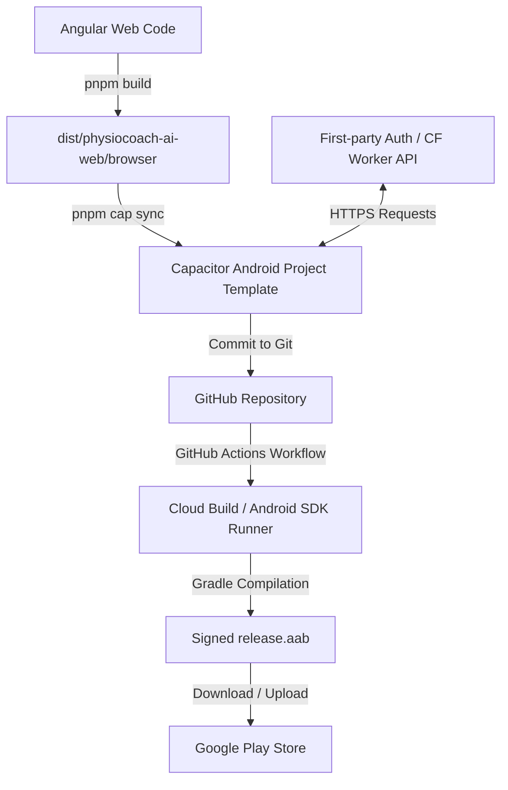

# Google Play Publishing Plan (Capacitor & Cloud Build)

**Goal:** Create a plan and workflow to wrap and publish the PhysioCoach AI Angular web application to the Google Play Store using Capacitor, compiling the native assets entirely in the cloud via GitHub Actions to address local disk space constraints.

**Approved Scope:**
- Integration of Capacitor (`@capacitor/core`, `@capacitor/cli`, `@capacitor/android`) into `physiocoach-ai-web`.
- Creation of `capacitor.config.ts` targeting Angular build outputs.
- CORS updates in the API backend (`physiocoach-ai-api`) to permit mobile origins.
- Deep linking / redirect configuration for first-party authentication.
- GitHub Actions CI/CD workflow to compile, build, and sign the Android App Bundle (`.aab`) in the cloud.
- Guidelines for local Keystore generation and Google Play Store submission.

---

## 1. Architecture & Local Project Setup

The app will be wrapped as a Hybrid Native application. The Angular application builds static web assets, which Capacitor loads inside an Android WebView wrapper.



### Dependency Additions
We will install the following packages in [package.json](file:///Users/rasoul/rasoul/PhysioCoach%20Ai/physiocoach-ai-web/package.json):
- `@capacitor/core`: Capacitor runtime.
- `@capacitor/cli`: Capacitor command-line management tool (as a devDependency).
- `@capacitor/android`: Native Android platform template (as a devDependency).
- `@capacitor/browser`: Native plugin to open external OAuth tabs in-app once the first-party OAuth initiator is implemented.
- `@capacitor/assets`: Command-line utility to auto-generate adaptive app icons and splash screens.

### Configuration (`capacitor.config.ts`)
A new [capacitor.config.ts](file:///Users/rasoul/rasoul/PhysioCoach%20Ai/physiocoach-ai-web/capacitor.config.ts) will be created in the root of the web project:
```typescript
import { CapacitorConfig } from '@capacitor/cli';

const config: CapacitorConfig = {
  appId: 'ir.otconnect.physiocoach',
  appName: 'PhysioCoach AI',
  webDir: 'dist/physiocoach-ai-web/browser',
  server: {
    androidScheme: 'https',
    hostname: 'physiocoach.otconnect.ir' // Ensures consistent origin headers
  },
  plugins: {
    Browser: {
      presentationStyle: 'overFullScreen'
    }
  }
};

export default config;
```

---

## 2. First-Party Authentication & API Support

Because the app runs inside an Android WebView container, we must configure how the API and authentication flows handle native web views.

### API CORS Policy
Capacitor on Android requests assets from `https://physiocoach.otconnect.ir` (as configured above).
- **Action:** We will verify that [physiocoach-ai-api/src/middleware/cors.ts](file:///Users/rasoul/rasoul/PhysioCoach%20Ai/physiocoach-ai-api/src/middleware/cors.ts) permits requests from the mobile hostnames (`https://physiocoach.otconnect.ir`, `https://dev.physiocoach-ai-web.pages.dev`) and `http://localhost`.

### OAuth Redirect Flow
Native app OAuth flows require launching a secure web browser window, logging in, and returning to the app via a custom scheme.
1. **Redirect Configuration:** In the first-party OAuth provider configuration, add the custom deep-link URI:
   - `ir.otconnect.physiocoach://oauth-callback`
2. **Deep Link Handling:** In Angular, listen to Capacitor App state URL events and route them through the first-party auth callback, preserving the authorization `code` and `state` for `/api/v1/auth/oauth/exchange`.
3. **App Manifest Configuration:**
   We will update `android/app/src/main/AndroidManifest.xml` to register the custom intent filter:
   ```xml
   <intent-filter>
       <action android:name="android.intent.action.VIEW" />
       <category android:name="android.intent.category.DEFAULT" />
       <category android:name="android.intent.category.BROWSABLE" />
       <data android:scheme="ir.otconnect.physiocoach" />
   </intent-filter>
   ```

---

## 3. Cloud Build Pipeline (GitHub Actions)

Since you do not have enough local disk space to install Android Studio (15GB+) and Gradle, we will execute all native compilation steps in the cloud.

We will create a GitHub Actions workflow file: `.github/workflows/build-android.yml`.

```yaml
name: Build Android App Bundle

on:
  push:
    branches: [ main ]
  workflow_dispatch:

jobs:
  build:
    runs-on: ubuntu-latest

    steps:
      - name: Checkout Code
        uses: actions/checkout@v4

      - name: Install pnpm
        uses: pnpm/action-setup@v3
        with:
          version: 11

      - name: Set up Node.js
        uses: actions/setup-node@v4
        with:
          node-version: 22
          cache: 'pnpm'

      - name: Install Dependencies
        run: pnpm install --frozen-lockfile

      - name: Build Web App
        run: |
          cd physiocoach-ai-web
          pnpm build

      - name: Sync Capacitor Android Project
        run: |
          cd physiocoach-ai-web
          npx cap sync android

      - name: Set up Java JDK 21
        uses: actions/setup-java@v4
        with:
          distribution: 'zulu'
          java-version: '21'

      - name: Setup Android SDK
        uses: android-actions/setup-android@v3

      - name: Build Android Release Bundle (AAB)
        run: |
          cd physiocoach-ai-web/android
          chmod +x gradlew
          ./gradlew bundleRelease

      - name: Sign Android App Bundle (AAB)
        uses: r0adkll/sign-android-release@v1
        id: sign_app
        with:
          releaseDirectory: physiocoach-ai-web/android/app/build/outputs/bundle/release
          signingKeyBase64: ${{ secrets.ANDROID_SIGNING_KEY }}
          alias: ${{ secrets.ANDROID_ALIAS }}
          keyStorePassword: ${{ secrets.ANDROID_KEYSTORE_PASSWORD }}
          keyPassword: ${{ secrets.ANDROID_KEY_PASSWORD }}

      - name: Upload Signed App Bundle Artifact
        uses: actions/upload-artifact@v4
        with:
          name: physiocoach-ai-android-release
          path: ${{ steps.sign_app.outputs.signedReleaseFile }}
          retention-days: 7
```

---

## 4. Keystore Generation & Secret Setup (Local Step)

To compile and sign the app securely without exposing passwords, you will run a lightweight, built-in Java tool on your macOS command line.

### Step 1: Generate Keystore
Run this terminal command (the generated keystore file is only 2KB):
```bash
keytool -genkey -v -keystore physiocoach-release.keystore -alias physiocoach-alias -keyalg RSA -keysize 2048 -validity 10000
```
- Keep track of the **Keystore Password**, **Key Password**, and **Alias**.

### Step 2: Convert Keystore to Base64 (For GitHub Actions)
Convert the keystore to a base64 string so it can be stored as a GitHub Secret:
```bash
openssl base64 -in physiocoach-release.keystore -out keystore-base64.txt
```
Copy the contents of `keystore-base64.txt`.

### Step 3: Add Secrets to GitHub Repository
In your GitHub repository settings, navigate to **Settings > Secrets and variables > Actions** and add these Secrets:
1. `ANDROID_SIGNING_KEY`: Paste the copied contents of `keystore-base64.txt`.
2. `ANDROID_ALIAS`: `physiocoach-alias` (your alias name).
3. `ANDROID_KEYSTORE_PASSWORD`: The password you set for the keystore.
4. `ANDROID_KEY_PASSWORD`: The password you set for the alias key (usually the same).

---

## 5. Verification Plan

Since you cannot run an emulator locally due to space constraints, we will verify the application in two ways:

1. **GitHub Action Validation**: Ensure the GitHub build completes successfully and produces a signed `.aab` file.
2. **Google Play Internal Testing Track**:
   - Upload the cloud-compiled `.aab` file directly to the **Internal Testing** track on the Google Play Console.
   - Whitelist your own email as a tester.
   - Install the **Google Play Console App** or open the internal testing link on your Android device to install and test the actual wrapped app live.

---

## 6. Non-Goals
- We will not add custom native Android plugins (like background Bluetooth or local file systems) in this phase.
- We will not design or build a separate native UI layout.
- We will not run native Android compilation locally (avoiding Gradle caches, SDK managers, and Android Studio installations).
